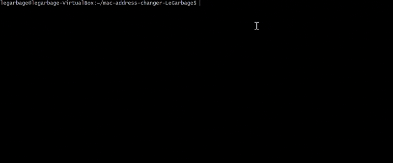
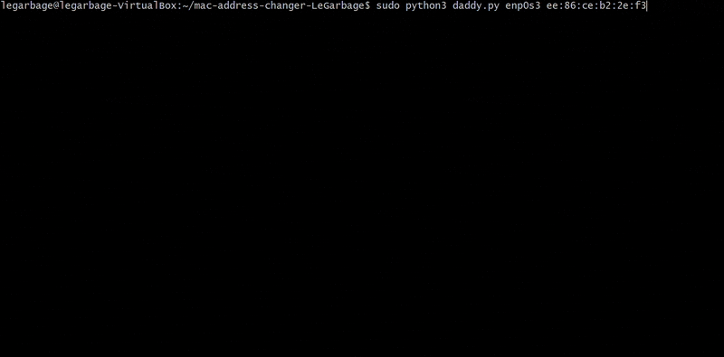

# MAC Daddy

*MAC Daddy* is a shell script that you can run on any linux computer to change its MAC address. When you use *Mac Daddy*, you will understand why it is the ultimate MAC address changer.

## Why use Daddy

You may be wondering why you'd even want to change your MAC address in the first place. There are many reasons, from your current MAC address not having your favorite number in it to stealing your neighboor's wifi. No matter your reason, *MAC Daddy* has you covered, allowing you to quickly chnage your MAC address.

## Daddy's Features

- **Change your MAC address.** This is what you're using *MAC Daddy* for. You can change your current MAC address to any other compatible address.
- **Input Validation.** If you accidentally input an invalid MAC address, you have no need to worry, your device will not be bricked. *MAC Daddy* automatically validates your MAC addresses so you don't have to worry.
- **Multiple network interfaces.** If you have more than one network card or have multiple network interfaces, such as using ethernet and WiFi, *MAC Daddy* can help you. *MAC Daddy* supports changing each network interface you have individually.
- **Backups.** MAC addresses are very hard to remember. Fortunately, *MAC Daddy* can remember for you. The first time you chnage the MAC address of an interface with *MAC Daddy*, it will save your former address. Of course, you can also reset your backups at any time.

## How to use Daddy

### Shell Script
- Run `chmod u+x daddy.sh` to give yourself executing permissions to run *MAC Daddy*
- Run `sudo ./daddy.sh [network interface] [mac address]` from the directory containing `daddy.sh`
- This will change your MAC address to your specified new address on your specified network interface
- The first time you run *MAC Daddy* on a network interface, it will automatically make a backup of your current MAC address before changing it
- To restore your MAC address from a backup, run `sudo ./daddy.sh [network interface] restore`
- *MAC Daddy* can only store one backup per interface. If you want to change your backed up address, run `./daddy.sh [network interface] clear`. This will remove your backup. To make a new one, simply change your address again. Just like the first time that you use *MAC Daddy*, it will back up your current MAC address before changing it.

### Python Script
- Install python
- Run `sudo python3 daddy.py [network interface] [mac address]` from the directory containing `daddy.py`
- This will change your MAC address to your specified new address on your specified network interface
- The first time you run *MAC Daddy* on a network interface, it will automatically make a backup of your current MAC address before changing it
- To restore your MAC address from a backup, run `sudo python3 daddy.py [network interface] restore`
- *MAC Daddy* can only store one backup per interface. If you want to change your backed up address, run `python3 daddy.py [network interface] clear`. This will remove your backup. To make a new one, simply change your address again. Just like the first time that you use *MAC Daddy*, it will back up your current MAC address before changing it.
